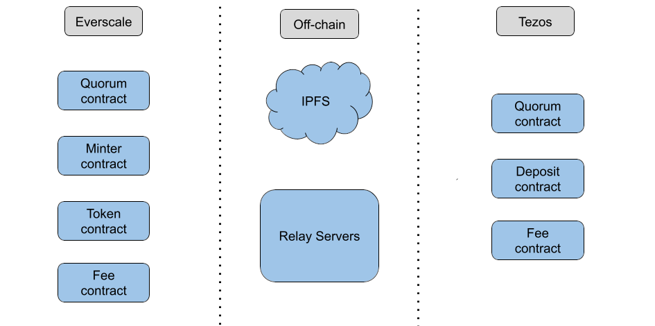
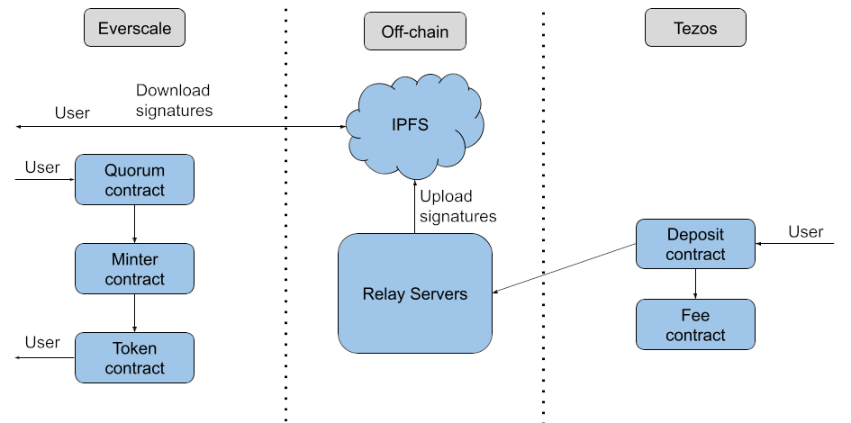
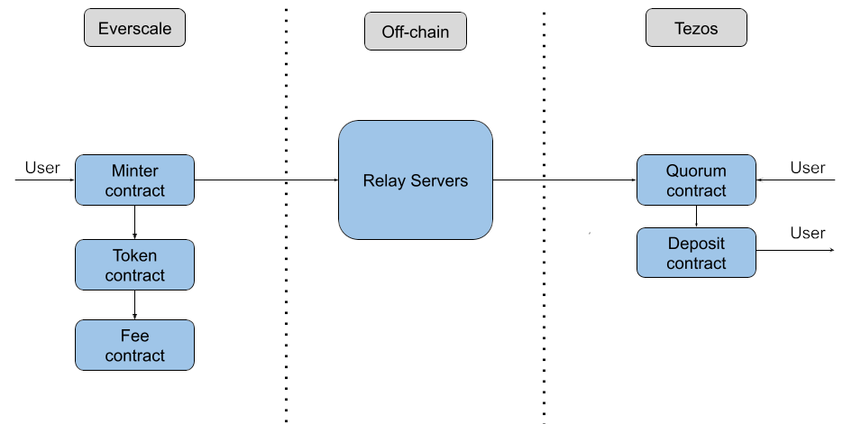

# Tezos-Everscale Bridge

## Project structure and repositories 

- [Relay server](https://github.com/Big-Kotik/tzs-ever-bridge-relay) monitors tezos wrap and everscale unwrap transactions. After receiving a transaction, the relay server validates it and sends the approving transaction to another blockchain;

- [Tezos contracts](https://github.com/Big-Kotik/tzs-ever-bridge-ligo-contract). Repository of all tezos side smart contracts;

- [Everscale contracts](https://github.com/Big-Kotik/tzs-ever-bridge-sol-contract). Repository of all everscale side smart contracts;

- [Front-end code](https://github.com/Big-Kotik/tzs-ever-bridge-frontend);

## Project Architecture

- Network overview

- Sending token to Everscale

- Sending token to Tezos
